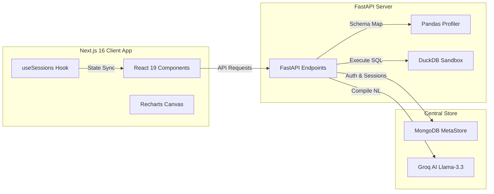

# Viza —  AI Data Analyst

Viza is a premium AI-powered Data Analyst client and analytical sandbox application. It allows users to upload spreadsheets or databases, auto-profile data structures, and chat with their datasets using natural language queries in plain English. Under the hood, Viza translates user prompts into high-performance SQL queries, executes them in a local analytical sandbox, and outputs rich interactive visualizations, logs, and explanations.

---

## 🚀 Key Features

* **Natural Language to SQL Translation**: Write complex database queries in plain English. The built-in query correction engine compiles and executes standard DuckDB SQL queries automatically.
* **Curved Visual Canvas & Logging**: Dual-pane workspace displaying chronological logs:
  * **Visualizations Tab**: Houses interactive Recharts charts (Line, Bar, Pie, Scatter) generated on-the-fly, backed by a blueprint drafting spinner loader.
  * **SQL Logs Tab**: Renders syntax-highlighted SQL transcripts with quick-copy capabilities.
* **Animated Multi-File Scanner**: High-fidelity file uploader drawer with an HTML canvas scanning animation (sweeping laser lines, glowing table cells, and floating sparks) profiling schemas in seconds.
* **Session Title Editing**: Inline title updates in breadcrumb headers, backed by immediate state synchronization and asynchronous database persistence.
* **Parity-Enabled Profile Settings Modal**: In-app modal interface to review and modify full name and email credentials, synced across all pages (Dashboard & Upload) and updating UI elements dynamically.
* **Clean Delete Session Flow**: Confirmation modals with high z-index overlay stacks, action locks, and animated button loading indicators during deletion.
* **Minimalist Empty States**: Minimalist vector drawings (dashed grids, isometric folders, and roadmaps) indicating empty dashboard history tables without AI boilerplate descriptions.

---

## 🛠️ Architecture & Technology Stack



### Frontend
* **Core**: Next.js 16 (App Router), React 19, TypeScript
* **Styling**: Tailwind CSS v4, HSL curated palettes, CSS Animations
* **Charts**: Recharts (interactive SVGs)
* **API Client**: Axios

### Backend
* **Web Framework**: FastAPI (Python 3.10+)
* **Analytical Sandbox Engine**: DuckDB (local file-based `analytics.db` database)
* **Data Profiling**: Pandas
* **Database (Metadata & Session Store)**: MongoDB (via PyMongo)
* **LLM Engine**: Groq SDK (`llama-3.3-70b-versatile` model)
* **Authentication**: JWT Tokens (using HS256 & Python-Jose)

---

## 💻 Local Setup & Execution

### 1. Prerequisites
* **Node.js** (v18+)
* **Python** (v3.10+)
* **MongoDB Instance** (Local Community Edition or Atlas URI)
* **Groq API Key** (Get yours from [Groq Console](https://console.groq.com/))

---

### 2. Backend Setup
1. Open a terminal and navigate to the backend directory:
   ```bash
   cd backend
   ```
2. Create a Python virtual environment:
   ```bash
   python -m venv venv
   ```
3. Activate the virtual environment:
   * **Windows (Command Prompt)**:
     ```cmd
     venv\Scripts\activate
     ```
   * **Windows (PowerShell)**:
     ```powershell
     .\venv\Scripts\activate
     ```
   * **macOS/Linux**:
     ```bash
     source venv/bin/activate
     ```
4. Install backend dependencies:
   ```bash
   pip install fastapi uvicorn pymongo duckdb pandas python-dotenv python-jose passlib bcrypt python-multipart groq
   ```
5. Create a `.env` file in the `backend/` directory:
   ```env
   GROQ_API_KEY=your_groq_api_key_here
   MONGO_URI=your_mongodb_connection_uri_here
   DATABASE_NAME=ai_data_analyst
   SECRET_KEY=your_jwt_secret_key_here
   ALGORITHM=HS256
   ACCESS_TOKEN_EXPIRE_MINUTES=1440
   ```
6. Start the FastAPI backend server:
   ```bash
   uvicorn app.main:app --reload --port 8000
   ```

---

### 3. Frontend Setup
1. Open a new terminal and navigate to the frontend directory:
   ```bash
   cd frontend
   ```
2. Install Node dependencies:
   ```bash
   npm install
   ```
3. Create a `.env.local` file in the `frontend/` directory (you can copy `.env.example` as a template):
   ```env
   NEXT_PUBLIC_API_URL=http://127.0.0.1:8000
   ```
4. Start the Next.js development server:
   ```bash
   npm run dev
   ```
5. Open your browser and navigate to `http://localhost:3000` to access the application.

---

## 🌐 Production Deployment

### Frontend (Vercel)
Vercel handles Next.js deployments out of the box:
1. Connect your repository to Vercel.
2. In the **Project Settings -> Environment Variables** tab on Vercel, add:
   * **Key**: `NEXT_PUBLIC_API_URL`
   * **Value**: The live domain URL of your hosted backend service (e.g. `https://api.yourdomain.com`).
3. Deploy the application.

### Backend CORS Configuration
To allow the frontend to communicate with your backend API:
1. Open [backend/app/main.py](file:///s:/Projects/natralLanguage/backend/app/main.py).
2. Append your Vercel deployment URL to the `allow_origins` array in the CORS middleware block:
   ```python
   app.add_middleware(
       CORSMiddleware,
       allow_origins=[
           "http://localhost:3000",
           "http://127.0.0.1:3000",
           "https://your-app-name.vercel.app"  # Your Vercel app domain
       ],
       allow_credentials=True,
       allow_methods=["*"],
       allow_headers=["*"],
   )
   ```
